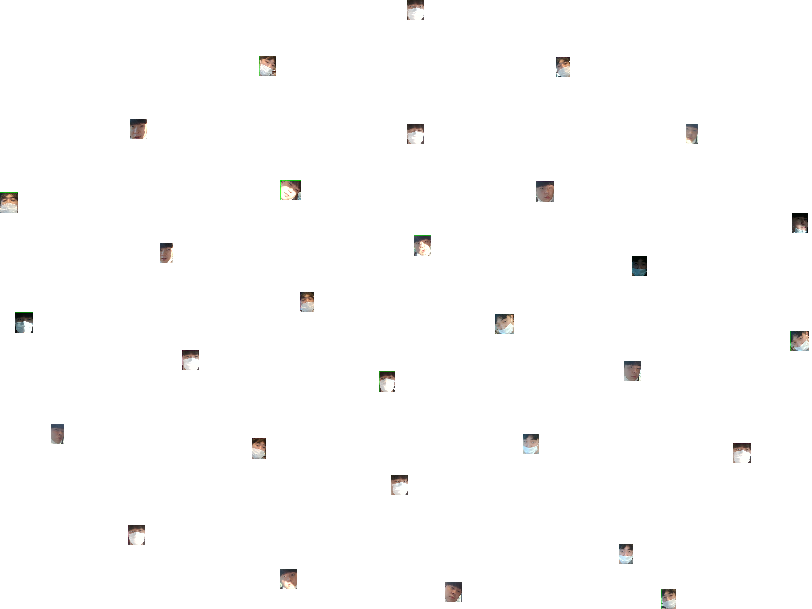

# 얼굴 인식 프로그램 - 박시온

## 얼굴 검출 (face_detection.py)

1. haar 모델 사용한 얼굴 검출

       #haar model를 불러옴.
       face_cascades = cv2.CascadeClassifier('./datas/haar/haarcascade_frontalface_default.xml')
       
       # 얼굴 검출하는 부분
       def detect_faces(img, draw_box=True):
       # 이미지를 흑색으로 바꾼다.
            grayscale_img = cv2.cvtColor(img, cv2.COLOR_BGR2BGRA)
    
            #얼굴을 검출한다.
            faces = face_cascades.detectMultiScale(grayscale_img, scaleFactor=1.1,
                                                   minNeighbors=5,
                                                   minSize=(30, 30),
                                                   flags=cv2.CASCADE_SCALE_IMAGE)
        
            face_box, face_coords = None, []
            # 검출한 얼굴 주위의 테두리를 그린다.
            for (x, y, width, height) in faces:
                if draw_box:
                    cv2.rectangle(img, (x, y), (x+width, y+height), (0, 255, 0), 5)
                face_box = img[y:y+height, x:x+width]
                face_coords = [x, y, width, height]
        
            return img, face_box, face_coords

[검출 전]

[검출 후]

## 7주차 진행사항 보고 (박시온)

### 얼굴 검출 3가지 분류

1. 하르 캐스케이스
2. dlib
3. CNN

3가지 비교 후 성능은 다음과 같음

하르 캐스케이스 < dlib < CNN
  

위 이미지 클릭 시  얼굴검출 시연 영상으로 연결

### 얼굴 인식 

1. 이미지 유사도를 판단하는 기법으로 접근해보았습니다.

Pre-trained 된 VGG16 모델을 가지고 특징 추출

추출한 특징을 PCA를 통해 차원 축소

T-sne 를 통한 임베딩 후 결과 무의미한 결과가 나왔습니다. (face_recognition_pca.py)

이후 얼굴인식 논문을 보다가 2015년도에 발표한 FaceNet을 보게 되었고 적용하였습니다.    
얼굴이미지를 128차원으로 임베딩하여 유클리드 공간에서의 이미지간의 거리를 통해 분류하는 모델입니다.   
기존 PCA로 하는 방식과 비슷해보이지만 Metric Learning을 하기위해 Triplet Loss를 사용한 부분에서 달랐습니다. 

유클리드 거리로만 계산하여 임베딩 한 결과 (PCA)

유클리드 거리를 계산 후 임베딩한 결과를 Triplet Loss를 적용시킴(FaceNet)  
이 방법을 통해 3개의 사진을 비교하여 동일 인물인 경우 기준이 되는 사진과 가까워지며,  
다른 인물인 경우 거리를 더 멀게함.  

각 구조별 셩능표 - 이 중 NN3구조를 사용.

위 이미지 클릭 시  얼굴인식 시연 영상으로 연결

### 참조 

1.[Face Recognition 2. FaceNEt 논문 리뷰]  https://hwangtoemat.github.io/paper-review/2020-04-02-FaceNet-%EB%82%B4%EC%9A%A9/ []

## 8주차 얼굴인식 프로그램

1. 서버를 통해 이미지 받아오기  

2. 받아온 이미지 특징 추출
3. 이미지 임베딩 후 array 저장 

   

