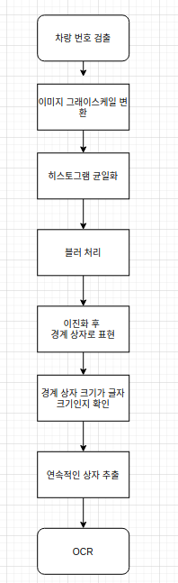
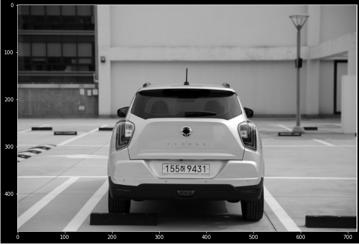
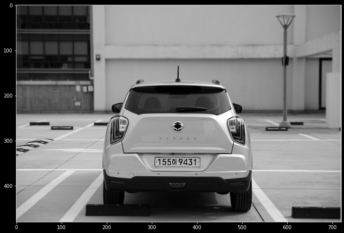
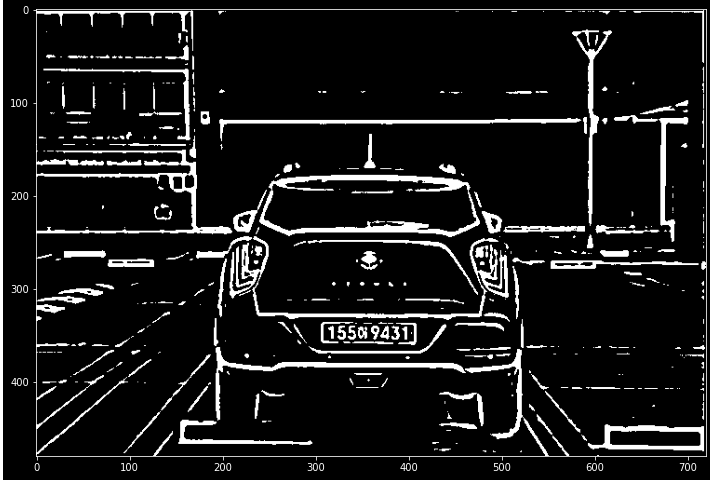
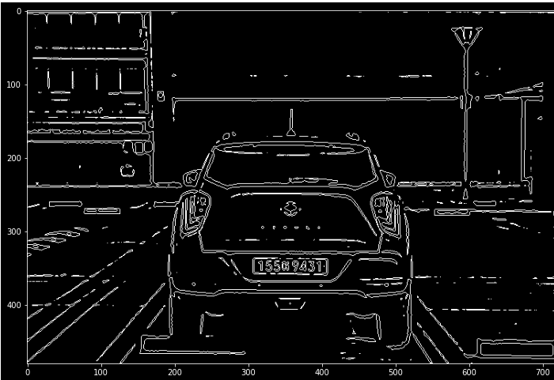
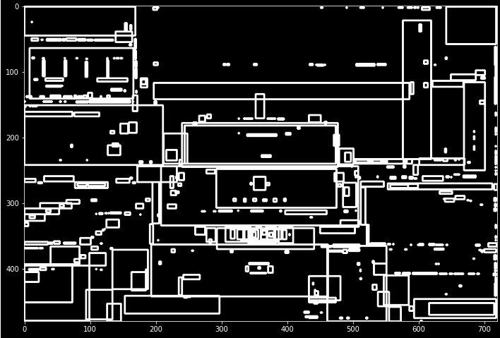
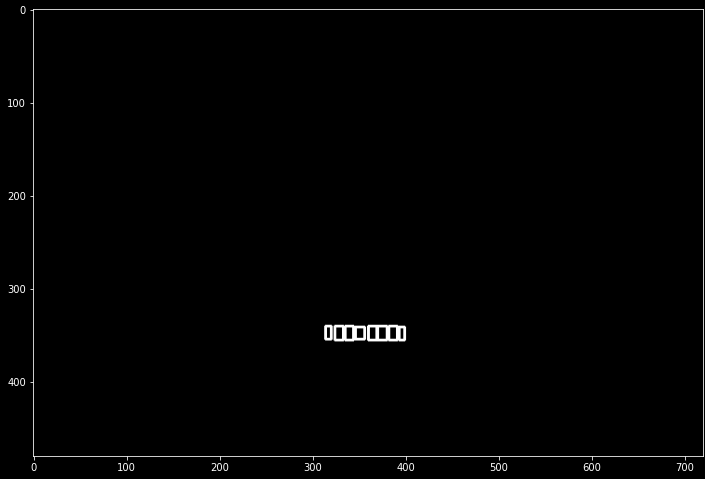
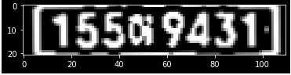
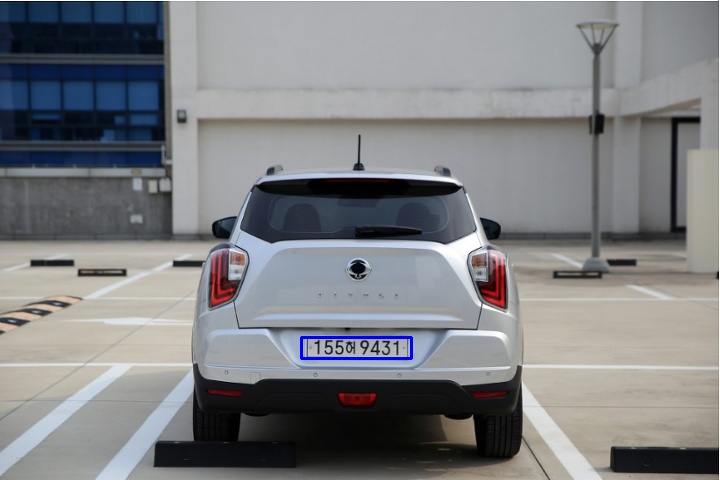

# 차량 번호판 검출 (박시온)

## 순서도

### step 1
####이미지 로드 

OpenCV를 통해 차량 이미지를 불러옵니다. 
-> 실제 이용 시 VideoCapture을 통해 지속적으로 검출.

### step 2
#### Grayscale 

이미지 처리를 위해 Grayscale 시킵니다.

### step 3
#### Maximize Contrast  

대조를 향상 시킵니다.

### step 4
#### Blur and Adaptive Thresholding  

GaussianBlur를 통해 노이즈를 제거하고 Thresholding 하여 이진화 합니다.

### step 5
#### Find Contours

이미지의 동일한 색 또는 동일한 색상 강도를 가진 부분의 가장 자리경계를 연결합니다.

### step 6
#### Contours BoX

Contours 값들을 Box로 표현합니다.

### step 7
#### Find Char Size Box

Box 중 번호판 숫자 크기의 상자를 찾습니다. 

### step 8
#### Find Continuous Box

찾은 Box중 연속되는 박스를 찾습니다. 
-> 번호판은 글자가 연속되어 나타남.

### step 9
#### Connection box and Clop

연속된 박스를 이어 하나의 박스로 만든 후 추출합니다.

### step 10
#### OCR

실제 실행 결과 한글 부분이 제대로 OCR이 안되는 경우가 있었습니다.
이런 경우 예외 처리로 00(한글)0000, 000(한글)0000 에 따라 한글 부분을 제외한 숫자만 검증하는 방식으로 진행할 것입니다.

