# HouseOfHope 희망의집

## 팀원소개

팀장 : 201621196 박시온  
팀원 : 201621213 이세환 201621223 천건호 201721578 서준혁

## 1주차 회의 내용

### 자료 조사 및 주제선정

#### 자료 조사

임베디드시스템으로 적용가능한 여러 항목을 알아보았습니다.

- IoT 스마트홈
- 드론 
- 자율주행자동차
- 화재현장 비전 투시 헬멧
- 색상별 물체 분류
- 자동 분리수거 쓰레기통 

이 중 세부적으로 설명을 하자면

##### IoT 스마트홈 

- 번호, 카드키가 아닌 얼굴인식을 통한 출입 통제
- 아파트 어플리케이션을 통한 IoT, 주차장, 방문객 등 

##### 드론

- 밸런싱 드론
- 재난지역 정찰 

##### 자율주행자동차

- 라인트레이서 
- 화재 인식 및 소화
- 자율주행

##### 화재현장 비전 투시 헬멧

- 연기가 많은 지역에서 시야 확보를 위한 헬멧
- 열, 빛화상 이미지를 통해 이미지 개선

##### 색상별 물체 분류

- 색상을 통한 물체 분류
- 색상을 통해 사과 당도 측정

##### 자동 분리수거 쓰레기통  

- 이미지 분류를 통한 물체 파악
- 물체에 따른 분리수거

## 2주차 회의내용

### 주제선정

제목 : IoT APT

요약 : 최근 화두가 되고있는 IoT를 이용하여 주거공간인 APT에 통합관리 시스템

주요 기능 
- 얼굴 인식을 통한 출입통제 (OpenCV, 딥러닝을 통한 얼굴인식, Door)
- 어플리케이션을 통한 방문자 관리 (사전 방문차량 및 인원을 등록하여 관리실에 들리지 않아도 통과)(Android app)
- 주차자리 알림 시스템 및 차량 확인(OpenCV, LED)
- 사용자 특성에 따른 IoT 홈시스템(etc ...)
  
### 역할분담 

박시온 : 딥러닝, 서버, DB, 센서 제어

이세환 : 안드로이드 앱, 센서 제어

천건호 : 안드로이드 앱, 센서 제어

서준혁 : 작품 디자인 및 제작

## 3주차 회의내용

### 주제에 대한 세부설명

1. 통합 출입 시스템 

    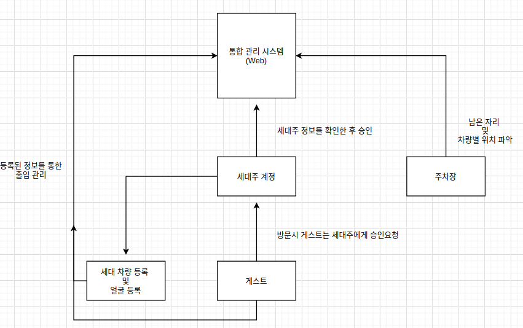  
    
    현관 
    1. 모든 권한 및 통제는 통합 시스템에서 관리 (관리사무소)
    2. 세대주는 입주시 어플을 통해 계정 생성 및 관리사무소에서 승인
    3. 승인 시 얼굴 및 차량 등록을 할 수 있음.
    4. 방문자는 게스트계정으로 세대주에게 출입 신청 및 차량등록을 할 수 있음.
    
    주차장
    1. 번호판 조회를 통해 사전 등록된 차량만 출입가능 (미등록시 출입 통제)
    2. 잔여 주차공간 파악
    3. 어플을 통해 내 차량찾기 사용가능   
   
2. 세대별 특성에 따른 추천시스템
    
    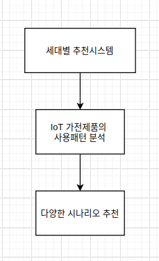  
    
    1. 홈IoT기기 or 출입 시간을 통해 사용자 패턴분석
    2. 이후 다양한 시나리오 및 추천을 제안
    
    ex) 
    1. 캠핑에 관련된 TV시청 및 검색이 많다면 -> 주변 캠핑장 추천  
    2. 일정한 시간마다 커뮤니티 시설이용시 (카페, 헬스장, 골프장, 사우나, 조식 등) 
    이용 10분전 오늘의 추천 음료 및 시설 이용상황 등 정보알림  

### 계획

통합 시스템을 먼저 개발후 점진적으로 기능을 늘려갈 예정. 

기술스택

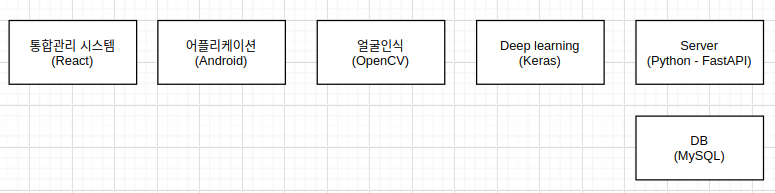  

웹 + 앱 + 서버 + 데이터베이스 + 딥러닝 + 임베디드를 통해 여러 기술스택을 경험할 수 있는 기회가 될거라 생각함.

## 4주차 회의내용

### 문제 인식
     
   - 현관 출입장치의 중요성
      
     DNA로 밝혀진 11년 전 주거침입 강간범에 징역 8년 선고 -연합뉴스  
     “남편 없는 집에 들어간 불륜남은 주거침입”이란 대법원 38년.. -로톡뉴스  
   
     아파트 단지에는 보안 및 방법을 위하여 영상 정보처리기기를 설치해야 한다.     
     공동주택관리법 시행령 제2조와 주택 건설기준 등에 관한 규정 제39조에서 그 근거를 찾아볼 수 있다.    
     현재 공동현관이 많이 설치되고 있는 추세이지만 오직 CCTV만이 설치된 아파트가 매우 높은 비율을 차지하고 있다.  
     공동주택관리법에 근거해 CCTV가 설치된 아파트는 많지만 보안성이 높고 편리한 시스템이 필요하다.  

    
   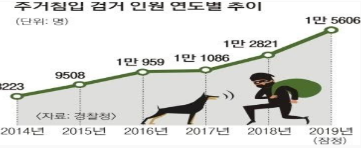  
    
   - 현관 출입장치의 보안 문제
    
     입주민 출입증 대신 '신용카드'로 아파트 출입.. 허술한 공동현관 보안 상태 - 디스패치  
     출처 : https://www.dispatch.co.kr/2052053  
    
     못 믿을 에스원… 아파트 보안시스템 '구멍’  
     보안절차를 거치지 않아도 문이 자동으로 열리는가 하면, 비밀번호가 제대로 읽히지 않거나 카드키가 작동하지 않는 경우도 빈번하게 발생하는 등 ‘출입통제시스템’이 무용지물이 된 것이다.  
     출처 : 시사위크(http://www.sisaweek.com)  
    
     아파트 보안의 생명인 현관 출입장치에 문제가 많이 발생하였다.  
     신용 카드 태그로 현관이 열리거나 카드키가 작동하지 않는 경우, 심지허 비밀번호가 제대로 읽히지 않는 경우도 있다.  
     또한 현관 출입장치 비밀번호는 주기적으로 바꾸지 않아 전 세대주도 비밀번호를 알고 있는 경우도 있으며, 카드키 분실도 큰 문제이다.  
    
     비밀번호, 카드키를 대체할 보안 인증이 필요하다.   
   
   - 일반인들의 삶의 변화 욕구 증가
   
     일반인들의 정보에 대한 욕구가 크게 증가하고 있고, 재택근무, 의료, 방범, 방재, 정보가전의 발달, 쾌적한 실내환경, 에너지 절감 및 편리한 생활 추구로
     주택문화의 변화가 빠르게 일고 있다.
     
   - 커뮤니티 시설의 확대와 편리성 추구
     보안 및 홈 오토메이션과 연계하여 정보가전, 온도, 조명, 가스밸브, 원격검침, 보안, 방재 등의 자동제어를 통한 에너지 절감 및 쾌적한 실내 환경을 만들고 편리한 생활을 영위할 수 있게 한다. 그리고 커뮤니티 시설의 확대를 통한 취미생활 및 편리한 생활을 추구하고 있다.

    
### 시장 조사

   1. 세계 IoT 시장규모 
   세계 IoT 시장 규모는 2018년 7,255억 달러로 전년 대비 14.9% 성장했으며, 2016~2022년까지 연평균 12.8% 성장하면서 1조 1,933억 달러에 달할 것으로 전망
   IoT 시장 중 서비스 시장이 2018년 2,272억 달러로 전체 시장의 31.3%를 차지하고 있으며, HW 시장이 2,157억 달러로 29.7%, SW 시장이 1,726억 달러로 23.8%, 커넥티비티 시장이 1,100억 달러로 13.5%를 차지하고 있음
   2016~2022년 연평균 성장률(CAGR)은 서비스 시장이 14.8%로 가장 높고, SW 시장 13.9%, 커넥티비티 시장 11.7%, HW 시장 10.5% 순으로 성장률을 기록할 것으로 전망됨

   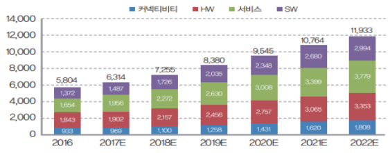 
   
   2. 국내 스마트 홈 시장 규모  
   국내 스마트 홈 시장 규모가 연평균 20% 이상 성장하고 추산하고 있다. 시장의 꾸준한 성장세를 바탕으로 이를 적용하기 위한 업계의 경쟁이 활발하다.  
   스마트 홈 기능은 지난 2010년대 중후반부터 발전해 현재는 스마트 홈 4.0 시대를 열고 있다. 외부 원격 제어 혹은 모니터링 기능뿐만 아니라 자율 동작, 개인 맞춤 플랫폼 간 연동 등 주요 기능이 확장되고 있다.  
   출처 : 뉴데일리경제

### 기획의도
  1. 출입카드 및 도어락을 대체한 얼굴인식을 통한 통합출입시스템 관리
     - OpenCV과 Deep Learning을 이용한 얼굴인식을 통한 출입통제
     - 세대주는 입주 시 어플을 통해 계정 생성 및 관리사무소 승인
     - 승인 시 얼굴 및 차량등록 가능
  
  2. 외부차량통제 및 주차장 잔여자리 파악을 위한 차량 출입관리시스템
     - OpenCV를 이용한 번호판 조회를 통해 외부차량 출입 통제
     - 초음파 센서를 통해 잔여 주차공간 파악 
     - 어플을 통해 내 차량 찾기 가능
  3. 가구원 일정관리 및 개인 별 특성에 따른 추천 시스템
     - 홈 IOT 기기와 출입 시간을 통해 사용자 패턴을 분석한다.
     - 통합출입시스템을 이용한 커뮤니티 시설(카페, 헬스장, 골프장, 사우나, 조식) 이용 시 10분 전 오늘의 메뉴 및 시설 이용상황 등 정보 알림

### 도입에 따른 효과

  1. 입주자 측면  
  통합출입관리시스템을 기반으로 한 커뮤니티 시설(다양한 컨텐츠 및 생활정보)를 이용하게 해주며, 에너지 절감, 쾌적한 시설, 편리한 생활공간 제공으로 삶의 질을 높여주는 역할을 한다.

  2. 아파트 관리자 측면  
  아파트 설비, 전력, 주차, 방범, 출입, 작업자 각종 시설물과 유지보수에 대한 효율적 관리를 통한 관리비 절감, 아파트의 생활과 안전의 증가, 아파트관리의 투명화로 입주민과의 신뢰성을 확보할 수 있다.

  3. 시공사 측면  
  회사의 인지도 상승과 기존 아파트와의 차별화를 통한 분양율을 극대화 하고, 인터넷을 통한 입주민의 A/S 접수 및 처리로 관리의 효율성을 높일 수 있다.
  
## 5주차 회의내용

### 디자인 시안 작성  (이세환)

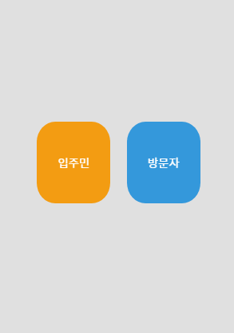 

첫 실행시 입주민과 방문자로 나뉨 

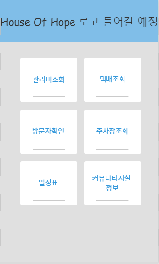

입주자는 아파트 관련 업무를 앱을 통해 처리
 
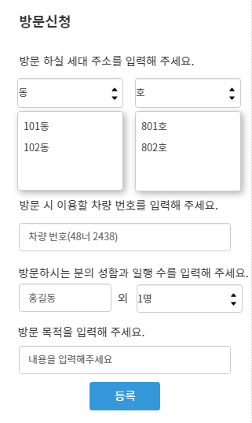 

방문자는 다음과 같이 방문등록을 신청할 수 있음

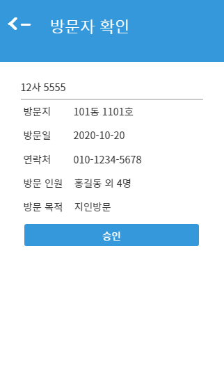 

입주자는 다음 요청을 승인하거나 거부할 수 있음

### 얼굴인식에 관한 기술 (박시온)

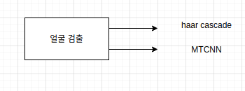

얼굴 인식에 관하여 첫 시작은 사람의 얼굴을 검출하는 것임.
얼굴 검출에는 OpenCV or Deep learning 의 방식이 있음

이번 프로젝트에서는 OpenCV의 haar cascade classifier과 Deep learning의 MTCNN을 활용하여
성능을 비교하고 사용하는 방법으로 진행할 예정임

### 안드로이드 앱 개발 (천건호)

현재 로그인 및 회원가입 개발 중

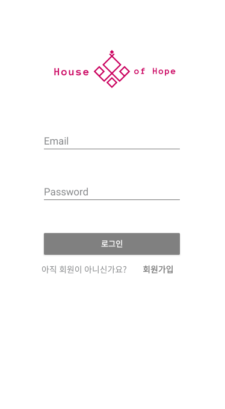

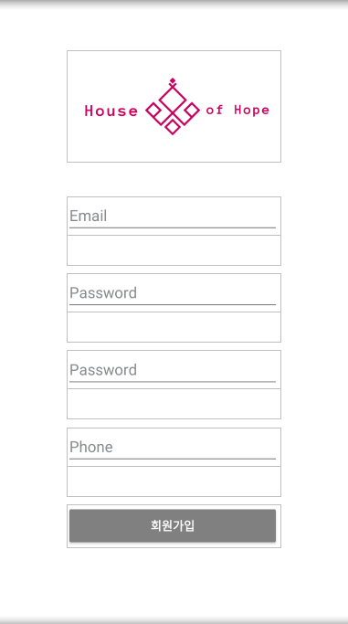

## 6주차 회의내용

### 안드로이드 앱 개발 (천건호)

현재 로그인 및 회원가입 : 유저 회원가입 및 로그인 activity 개발
APP API Interface : Retrofit2를 이용한 Server와 API 통신 Interface 개발

방문자 계정 사용 신청 시 입주자에게 승인요청

### 안드로이드 앱 디자인 개발  (이세환)

Loading Activity : 인트로 페이지

초기 화면

입주자 메인 화면

입주자, 방문자 각 버튼 클릭 시 

