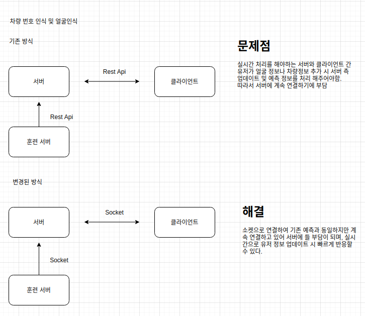

# SERVER  구성 - 박시온

개발 환경 : Ubuntu18.0.4  
라이브러리 : Python (3.6.8) - FastAPI  
DB : Mysql  

## 디렉토리 구성 

/backend  
|  
| main.py  
|  
| classes/   
|   
| config.json  
|  
| READMD.md  

## 10주차 
2020/10/28 초기 환경 구성    
2020/11/1 login, register 기능 추가    

## 11주차 
2020/11/13 login, register 테이블 정보 변경  
2020/11/13 DB -> strapi 로 변경   
2020/11/13 GuestClass 추가    
2020/11/13  방문신청, 방문자 내용 조회, 방문자 내용 업데이트 API 추가

## 13주차

Face 예측 Socket 으로 변경 

  

## 14주차
1. 사용자 얼굴 등록 시 저장 로직 생성
2. 5장 이상 등록 시 Train 하는 로직 생성 
